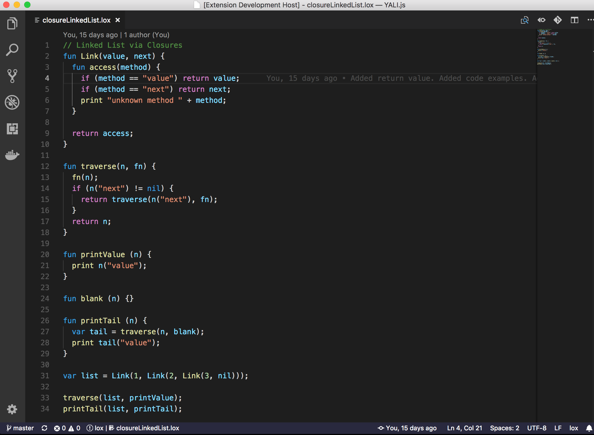

# Lox Language
Syntax highlighting for [everyone's favorite interpreted learning-language](https://craftinginterpreters.com/the-lox-language.html)!

## What is Lox?

Lox is a Dynamically Typed Programming Language created by [Bob Nystrom](https://twitter.com/intent/user?screen_name=munificentbob) for his excellent book [Crafting Interpreters](https://craftinginterpreters.com).

## What is Lox Language
This is a simple syntax-highlighting module for `.lox` files. It doesn't contain snippets, autocomplete, error highlighting or anything fancy like that.

If you want an implementation of the Lox language, the source for Bob Nystrom's initial Java implementation, "jlox" is located [here](https://github.com/munificent/craftinginterpreters), and if you want a Javascript implementation that can be run in your browser, I recommend you try [YALI.js](https://github.com/danman113/YALI.js), my implementation of the Lox language.

## Build Instructions

To build, navigate to the root directory and run `vsce package`. This will create a `.vsix` file which can be imported to VSCode.

## Contribute

For any bugs and feature requests please [open an issue](https://github.com/danman113/lox-language/issues). For code contributions please create a [pull request](https://github.com/danman113/lox-language/pulls). Enjoy!
